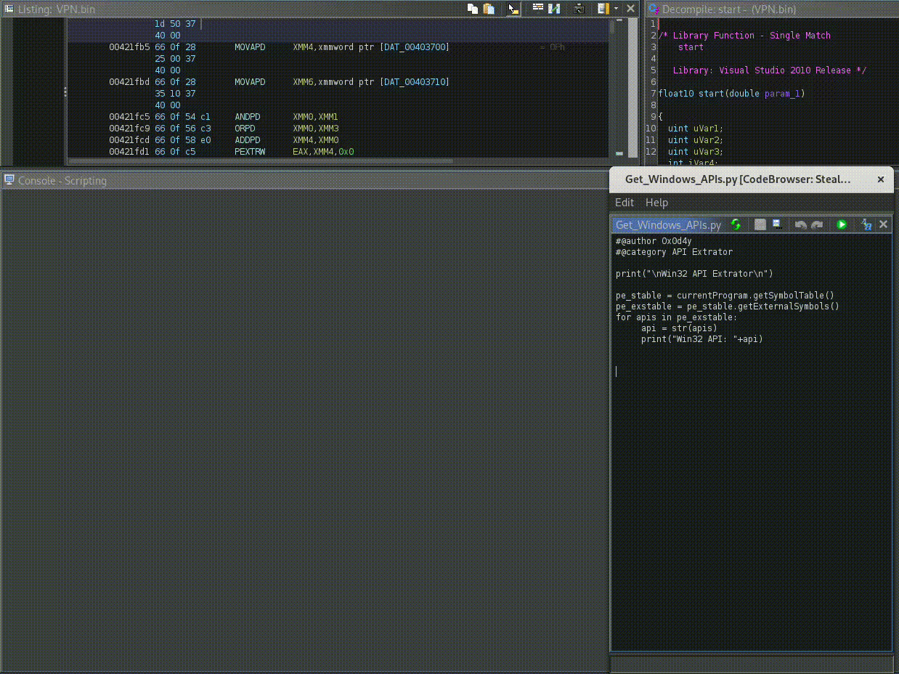

  

# Python Scripts for Ghidra RE Automation

This repository aims to store my automation scripts for collecting information from binaries, during the reverse engineering process in *Ghidra*.

  

The scripts are developed in *Python*, and can be imported into **Ghidra's Script Manager** to be used in your projects!

## Under Development

Over time, whenever I create a script to automate a procedure in Ghidra, I will update this repository.

  

At the moment, this repository has:

- **Win32API_Extrator.py** -> extracts information from the **Import Table**, to identify *Win32 APIs* (and other Imports) used by the binary under analysis.

